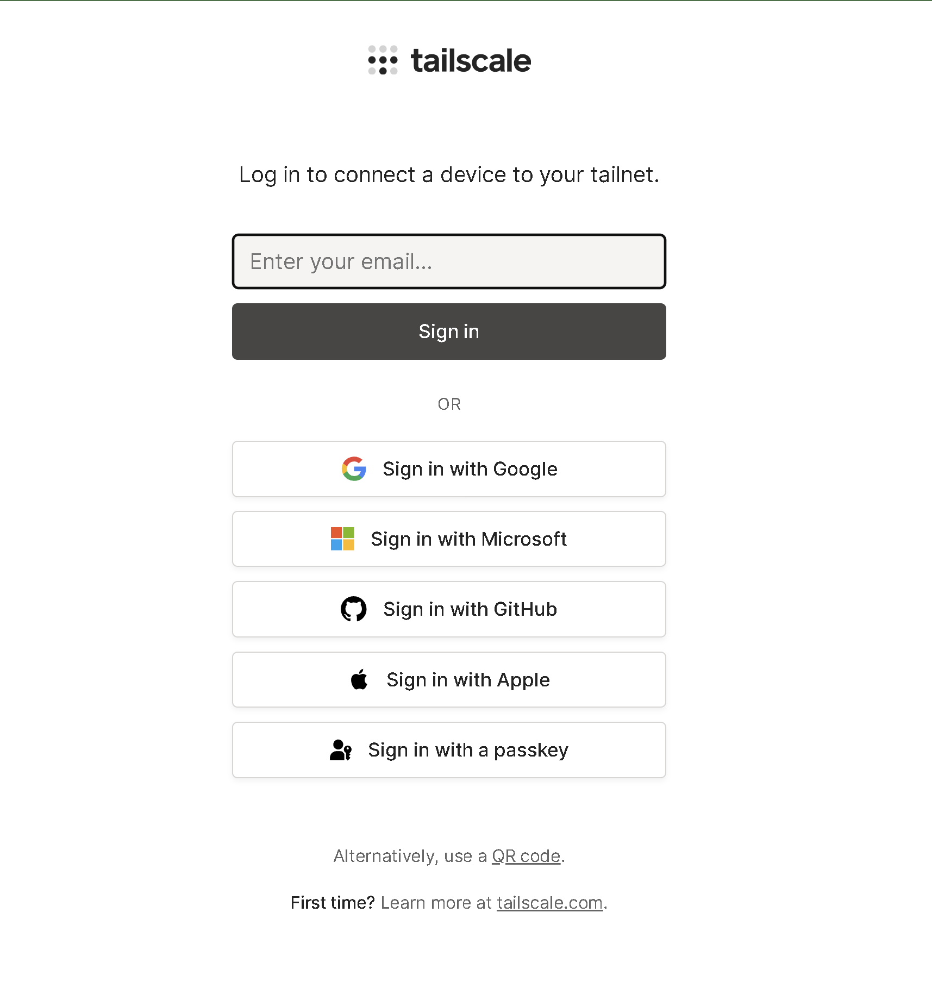
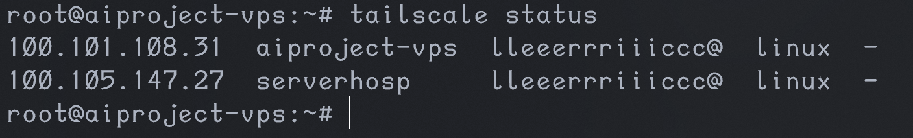

# Instal·lació de Tailscale  
## Projecte Intermodular  

**Autors:**  
Eric Lopez  
Nil Parra  

---

## Índex

1. [Motiu d’ús](#1-motiu-dús)  
2. [Servidor Local](#2-servidor-local)  
   - 2.1 [Instal·lació](#21-instal·lació)  
   - 2.2 [Primers passos](#22-primers-passos)  
   - 2.3 [Verificacions](#23-verificacions)  
   - 2.4 [Post-instal·lació](#24-post-instal·lació)  
3. [Servidor Cloud](#3-servidor-cloud)  
   - 3.1 [Instal·lació](#31-instal·lació)  
   - 3.2 [Primers passos](#32-primers-passos)  
   - 3.3 [Verificacions](#33-verificacions)  
   - 3.4 [Post-instal·lació](#34-post-instal·lació)  

---

## 1. Motiu d’ús  

La nostra infraestructura de replicació requereix una connexió entre el cloud i la xarxa privada, ja que estem sota NAT de l’ISP i protegits per un firewall.  

Degut a aquesta problemàtica, hem investigat diverses solucions:  

- Túnel TCP amb Ngrok  
- Túnel SSH genèric  
- VPN amb Tailscale  

Els túnels TCP amb Ngrok probablement requereixen pagament i són limitats, per tant s’ha descartat aquesta opció.  

Els túnels SSH també s’han descartat degut a la possible inestabilitat.  

Finalment, s’ha escollit **Tailscale**, una xarxa virtual amb túnels TCP.  

És l’opció més estable, tot i que també la més complexa d’implementar. És open source i gratuïta.  

L’únic inconvenient és la possibilitat que no funcioni correctament amb el nostre proveïdor de cloud. En aquest cas, es valoraria utilitzar alguna de les altres opcions.

---

## 2. Servidor Local  

En aquest apartat veurem la instal·lació i configuració en el servidor local.

### 2.1 Instal·lació  

```bash
curl -fsSL https://tailscale.com/install.sh | sh
```

### 2.2 Primers passos  

```bash
sudo tailscale up
```



### 2.3 Verificacions  

```bash
tailscale status
tailscale ip
```

### 2.4 Post-instal·lació  

```bash
sudo systemctl enable tailscaled
```

---

## 3. Servidor Cloud  

### 3.1 Instal·lació  

```bash
curl -fsSL https://tailscale.com/install.sh | sh
```

### 3.2 Primers passos  

```bash
sudo tailscale up
```


### 3.3 Verificacions  



### 3.4 Post-instal·lació  

```bash
sudo systemctl enable tailscaled
```
